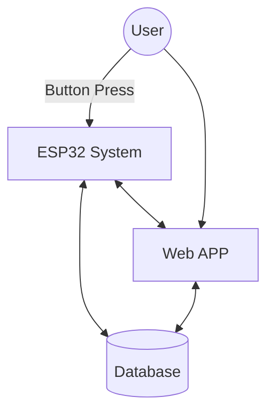
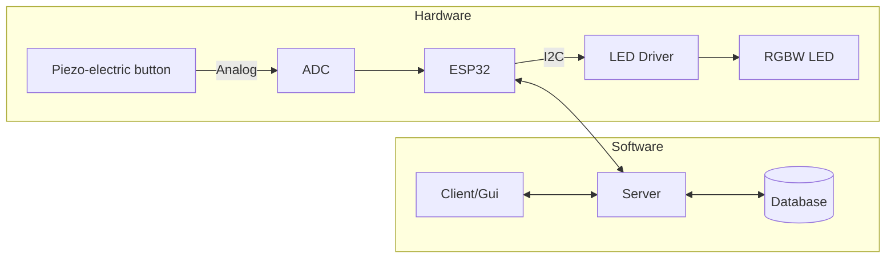

# The Cube - Mediation Device

**Course:** Software Systems
**Status:** In Development

## Features 
- **Press to Meditate**
- **Webapp Control of Cube**
- **Customizable Colors**
- **Customizable Breathing Paterns**
- **Customizable Times**
- **Meditation Tracking**
- 
-
-

## About
This is application/product project for a meditation cube.
- Modular Design
- Network Communication
- Security Fundamentals

**Team Members:**
1. Parry Zhuo
2. Sasha Roosen-Saba
3. Bryce Reid
4. Kale Wyse
