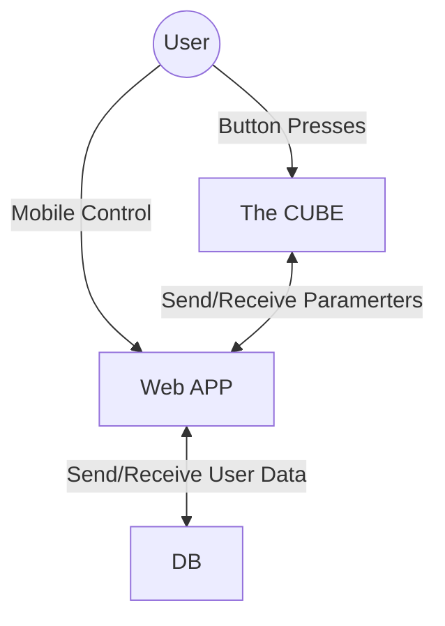

# System Architecture - The CUBE


## Context Diagram 



```mermaid 


## 
graph LR
    subgraph Hardware
        P[Piezo-electric button] -- Analog --> ADC[ADC]
        ADC --> ESP[ESP32]
        ESP -- I2C --> LED_D[LED Driver]
        LED_D --> RGBW[RGBW LED]
    end

    subgraph Software
        W_APP_CLIENT[Client/Gui]
        subgraph Server
            W_APP_SERVER[Server]
        end
        DB[(Database)]
        


    end

 
    %% Communication Flows
    W_APP_CLIENT <--> W_APP_SERVER
    ESP <--> W_APP_SERVER
    W_APP_SERVER <--> DB
```