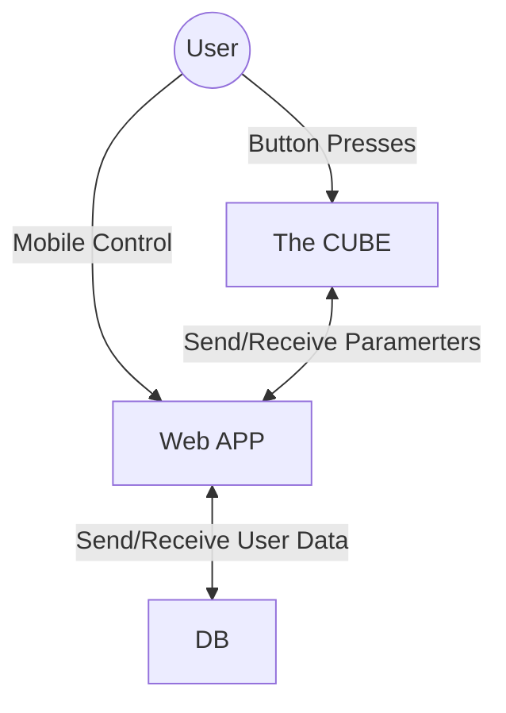
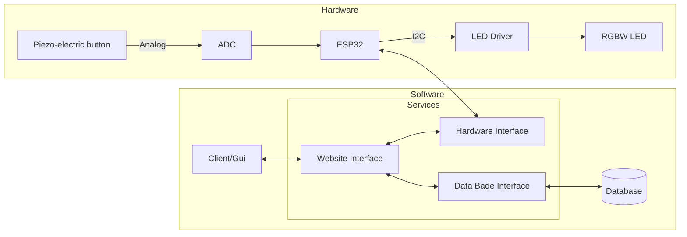

# System Architecture - The CUBE

## Context Diagram 

```mermaid 
graph TD
    User1((User)) -- Button Presses --> ESP[The CUBE]
    User1((User)) -- Mobile Control --> W_APP[Web APP]
    
    W_APP -- Send/Receive User Data <--> DB 

    ESP -- Send/Receive Paramerters <--> W_APP

```

## Component Diagram

```mermaid 

graph LR
    subgraph Hardware
        P[Piezo-electric button] -- Analog --> ADC[ADC]
        ADC --> ESP[ESP32]
        ESP -- I2C --> LED_D[LED Driver]
        LED_D --> RGBW[RGBW LED]
    end

    subgraph Software
        W_APP_CLIENT[Client/Gui]
        subgraph Services
            CUBE_COMM[Hardware Interface]
            WEBSITE_COMM[Website Interface]
            DB_COMM[Data Bade Interface]
        end
        DB[(Database)]
        


    end

 
    %% Communication Flows
    W_APP_CLIENT <--> WEBSITE_COMM
    WEBSITE_COMM <--> CUBE_COMM
    WEBSITE_COMM <--> DB_COMM
    DB_COMM <--> DB
    ESP <--> CUBE_COMM
    
```

## Arcitechtural Pattern Justification 
