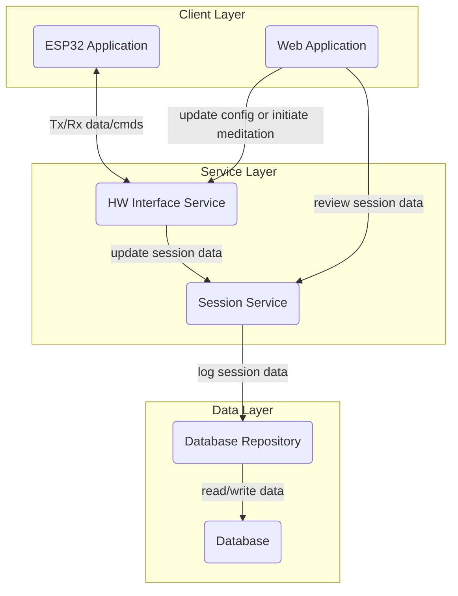

# System Architecture - The CUBE

## Context Diagram 

## Component Diagram

## Architectural Pattern Justification 
Why did we choose the layered approach?
The layered (N-tier) architectural approach was chosen because the system contains a moderate number of distinct responsibilities within each client( hardware, and software). For example the hardware has the need to do ADC sampling, I2C communication protocol while the software for the “computer/phone” has its own set of responsibilities such as interfacing with a GUI, sending commands to the BreathingCube. In addition to this, the hardware is quite rigid in the structure making it suitable for the N-layered approach.

Why did we not choose the client-server approach?
While the client–server model is effective for defining communication boundaries and centralizing data, it was not chosen as the primary architectural pattern because it is too high-level to address the internal complexity of this system. In this project, the clients vary significantly in their responsibilities and internal structure. For example, the ESP32 client includes hardware-specific logic such as button handling, LED control, timing, and power management, while the web or mobile client focuses on user interaction, visualization, and configuration.

Why did we not choose the microservices approach?

A microservices architecture was not chosen because the backend requirements are simple and centered around a single shared database. The system does not require independent services with separate data ownership or scaling characteristics. Introducing microservices would add unnecessary complexity, such as multiple service deployments and inter-service communication, without providing meaningful benefits for the project’s scope.
